# STUDY-html_css

기본적인 HTML과 CSS에 대한 공부 기록

---

<a href="https://codingapple.com/">공부할때 수강한 인강(1)</a>

---

## HTML 기초와 기본 구조

모든 html 파일은 항상 이렇게 써놓고 시작해야 한다.

```html
<!DOCTYPE html>
<html>
  <head>
    <meta charset="UTF-8" />
    <title>Document</title>
  </head>
  <body></body>
</html>
```

---

## HTML 기본 태그

HTML은 Markup Language로 자료가 어디에 어떻게 배치되어있나(자료의 구조)를 표현하기 위한 언어이므로 태그 안에 글을 적어주는것이 좋다.

```html
<h1></h1>
<p></p>

<button>버튼</button>
<a href="주소">링크</a>
<ul>
  <li>항목1</li>
  <li>항목2</li>
</ul>
```

- h1 태그의 h는 heading의 약자로 글 제목을 적을때 사용한다.

  (h1~h6까지 사용할수 있고, 숫자가 커질수록 글자 크기가 작아진다)

- p 태그는 paragrpah의 약자로 문단을 나눌때 사용한다.
- img 태그는 src라는 속성에 "이미지 경로"를 넣어줘야 한다.
- 말 그대로 버튼을 생성한다.
- href 속성에 이동할 링크 주소를 적어 링크를 생성한다.
- 리스트는 `<ul><li>리스트</li></ul>` 와 같이 작성한다.
  (그리고 ul은 unorder list의 약자이고 li는 list item의 약자이다)
- 리스트에 자동 번호를 넣고싶다면 ul대신 ol(order list)을 사용하면 된다.

- 이미지 누르면 특정 사이트로 이동하게 할수 있음

  `<a href="주소">  </a>`

- <문제> 글자의 일부를 눌렀을때 네이버로 이동하게 하려면 어떻게 해야할까?

```html
<p>안녕하세요 <a href="https://naver.com">이동하기</a></p>
```

### [정리]

> 웹 페이지 만들때 모든 요소는 태그 안에 작성한다.

> 일부 태그는 속성을 기입할수 있다. ex) src, href

> 태그 안에 태그도 넣을수 있다. ex) `<ul><li></li></ul>`

---

## 기본적인 웹페이지 스타일링

html 꾸미는 법 => style 속성을 이용해 스타일명:값 형태로 작성한다.

``

<span style="color:orange">이미지를 가운데 정렬하는 법</span>

> display: block;

> margin-left: auto;

> margin-right: auto;

이 3가지를 적어주면 된다.<br><br>

<단위 종류>

- vw: 현재 브라우저 창의 너비를 의미 따라서 16vw면 현재 브라우저 창의 16배로 설정

- %: 내 부모 사이즈에 비례 100%면 내 부모 사이즈의 100%로 설정<br><br>

<글자 스타일링 방법>

- font-size: 폰트 크기 설정
- font-weight: 폰트 굵기 설정

  `<strong></strong>` 태그를 이용해도 된다.

- font-family: 폰트 종류 설정
- color: 폰트 색상 설정
- letter-spacing: 자간 간격 조절
- text-align: center -> 글자 가운데 정렬

(text-align: right는 오른쪽 정렬, left는 왼쪽 정렬)<br><br>

<문제> 문장 중에 일부 글자만 스타일링 하고싶으면 어떻게 할까?

`<p><span style="color:red">Front-end</span> Developer</p>`

이런식으로 작성해준다.

span 태그란 글자를 감쌀수 있는 별 뜻 없는 태그라고 생각하면 된다.

---

## 레이아웃의 기초 - div

div: division의 약자로, 화면을 분할하겠다는 의미. 네모난 박스 만들고 싶을때 사용하자.
<br><br>

### `<div>` 박스 디자인에 자주 사용하는 속성들

1.  margin: 상하좌우 "바깥쪽" 여백 (margin-top/bottom/left/right도 있음)

    > margin은 음수도 가능함

    > margin: 5px 6px 7px 8px 과 같이 사용하면 순서대로 상 우 하 좌 여백을 준다.

2.  padding: 상하좌우 "안쪽" 여백

3.  border: 테두리(ex. border: 4px solid black;)

4.  border-radius: 테두리를 둥글게 하고싶을때

5.  div 박스도 가운데 정렬하고 싶으면 이미지와 마찬가지로 아래 css를 사용한다.

> display: block;

> margin-left: auto;

> margin-right: auto;

<br>

### `<div>` 박스의 특징

1. display: block 이 기본으로 있음(따라서 생략 가능)

   또한 p, h1, li 등의 태그도 display: block 속성이 기본적으로 내장되어있다.

   따라서 이 태그들을 그냥 사용하면 한 행을 전부 차지하게 되므로 display 속성에 inline, inline-block, flex 등을 이용해 다른 것을 부여해서 바꿀 수 있다.

font-size, color, font-family, text-align과 같은 속성들은 부모 태그에 적어주면 안의 자식 태그들까지 전부 상속(inherit) 된다.

---

## 레이아웃 만들기(1) - float

Tip) 여러 레이아웃을 만들기 전에 여러 레이아웃을 한번에 감싸는 박스를 만들어두면 유용하다.

생성한 박스들을 눈에 보이게 하려면 스타일에 width와 height 값을 주자.

layout1.html의 mainContent에 css를 주고나면 아래 이미지처럼 해당 박스가 leftMenu의 오른쪽이 아닌 아래쪽에 나타나는것을 볼 수 있다. 왜 그럴까?

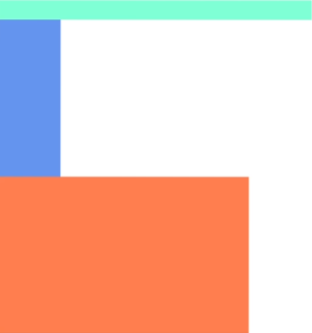<br>

> <strong>div 박스들은 모두 display: block 속성을 내장</strong>하고 있기 때문에 가로행을 전부 차지한다.
> 따라서 leftMenu의 width: 20%여도 실제로는 화면의 가로행을 다 차지하고 있기 때문에 다음 div 박스는 아래에 위치하게 된다.

이것을 해결하는 방법에는 먼저 css에 float 속성을 이용하는 방법이 있다.

`float: left;`

이는 해당 요소를 붕 띄워서 왼쪽에 정렬하라는 의미를 가지고 있다.

오른쪽으로 정렬하고 싶으면 float: right를 사용하자.

<span style="color: orange">즉, 박스를 가로로 배치할 때 float를 사용해보자.</span>

아래 코드처럼 레이아웃 구조가 있다고 해보자.

```html
<body>
  <div class="container">
    <div class="header"></div>
    <div class="leftMenu"></div>
    <div class="mainContent"></div>
    <div class="footer"></div>
  </div>
</body>
```

```css
/* footer의 css */
.footer {
  width: 100%;
  height: 100px;
  background-color: grey;
}
```

이때 footer에 css 스타일을 작성하면 footer는 아래 이미지처럼 leftMenu와 mainContent의
뒤에 가려져서 안보이게 된다.

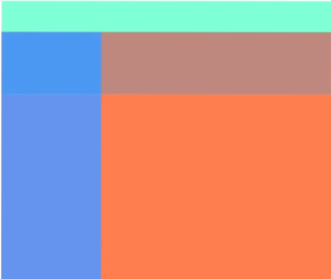

<br>
이렇게 되는 이유는 이전에 leftMenu와 mainContent의 스타일로 float를 주었기 때문에 이 둘은 공중에 떠있는 상태다. (아까 float를 사용하면 요소가 붕 뜬다고 적어놨다.)
따라서 footer는 이 붕 떠있는 요소들 뒤에 위치하게 되는 것이다.

이를 해결하려면 어떻게 해야할까?

`clear: both;`

이것을 사용하자. 이는 float 다음에 오는 요소에게 주면 float를 사용함으로써 발생하는 위와 같은 현상을 해결할 수 있다.

---

## 레이아웃 만들기(2) - inline-block

이전에 배운 float 말고 박스를 가로로 배치할 수 있는 다른 방법이 있다.

```css
.leftMenu {
  display: inline-block;
  width: 20%;
  height: 400px;
  background-color: cornflowerblue;
}
```

> display: block -> 한 행을 전부 차지한다.

> display: inline-block -> 자신의 크기만큼 자리를 차지한다.
> ex) 한글에서 이미지 넣으면 글자와 어울림하는 느낌

그런데 문제가 있다.

### inline-block 사용하면 일어나는 문제점(1)

inline-block을 사용하면 각 박스를 생성한 코드 사이의 빈 공간(ex. 스페이스바)만큼 실제 레이아웃 사이에도 공백이 생겨버려 가로배치가 아닌 세로배치가 될 수도 있다.

따라서 inline-block을 사용하려면 공백을 제거해줘야 한다.

<공백 제거 Tip>

1. html 주석을 이용해 엔터를 사용한처럼 만들어주기
2. 부모 태그에 font-size: 0px; 주기

근데 부모 태그에 font-size: 0px을 주면 그 아래 자식들 블록 안에 글을 작성하면 크기가 0이라 보이지 않게 된다. 그래서 글을 쓸 블록 태그에 다시 font-size를 줘야한다.

(즉, 공백 제거하기 귀찮으므로 그냥 float를 쓰는게 나을것 같다.)

### inline-block 사용하면 일어나는 문제점(2)

inline-block으로 생성된 박스 안에 p태그 같은거 이용해서 글쓰면 정렬이 망가진다.

왜 그럴까?

글자를 입력할때 가상의 baseline이 존재하는데 만일 baseline이 옆에 존재한다면 display: inline-block 요소들이 baseline의 위에 오려고하기 때문이다.

<strong>해결법</strong>은 해당 요소의 스타일에 `vertical-align` 속성값을 주는것!

vertical-align 속성은 상하정렬의 역할을 하는 것으로 위로 보낼건지 밑으로 보낼건지 결정하는건데 이는 inline 을 가지고 있는 요소들에만 적용이 가능하다.

---

## 직접 Blog 글 목록 만들어보기

직접 주어진 디자인을 따라 레이아웃을 만들어보며 알게된 점을 기록했다.

1. `<p>`태그와 `<div>`태그의 차이점

div 태그를 사용해 글을 작성해보면 작성한 글이 블록의 왼쪽 위 모서리부터 딱 붙어서 작성되었는데 p 태그를 사용해 글을 작성해보니 자동으로 margin이 생겨있었다.

> div 태그를 사용한 경우
> 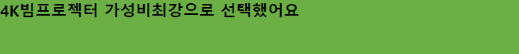

> p 태그를 사용한 경우
> 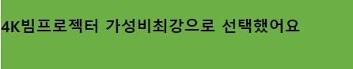

<strong>p태그는 기본적으로 margin의 상하값에 간격이 들어가 있으므로</strong> css를 초기화하거나 p태그에 margin: 0 값을 넣어주지 않았다면 위와 같은 상황이 발생할 수 있다.

또한 p태그는 블록 요소이긴 하지만, 자식 요소로 다른 블록 요소를 가질 수 없다.

그리고 아까 p태그 안에 p태그를 넣었는데 개발자 도구에서 확인해보니 아래 코드처럼 p태그 안에 p 태그가 들어있지 않고 나누어져 있는걸 볼 수 있었다.

```html
<p>안녕,</p>
<p>안녕하세요!</p>
```

즉, p태그 안에 p태그는 삽입이 불가능하다는 것을 알게 되었다.

### 추가 지식

`<div>` vs `<p>` vs `<span>`

div와 p 태그는 블록 요소로 태그의 영역이 가로행의 전체를 자치한다.

하지만 span 태그는 인라인 요소로 태그 안에 적힌 문자 정보의 길이만큼만 영역을 차지한다.

따라서 <strong>문자 내용을 줄바꿈 하면서 작성</strong>해야 하는 경우 `<div>`와 `<p>` 태그를 사용하고,
<strong>줄바꿈 없이 사용할 영역만 작성하고 다른 블록 요소 등에 포함</strong>되어야 할 경우 `<span>` 태그와 같은 인라인 요소를 사용한다.

즉, 더 작은 영역의 요소를 나타내는 span 태그 안에는 더 큰 영역을 가진 div, p 태그가 포함될 수 없다.

이제 지금부터는 이번 과제를 수행하면서 배운 작은 TIP과 소감을 적어보겠다.

1. 무엇을 만들든 레이아웃은 항상 `<div>`등을 이용한 박스부터 만들고 시작한다.

2. PC 레이아웃을 만드는 경우 항상 container이나 OOOWrap과 같은 커다란 박스를 만들어 놓는것이 좋다.
   또한, 이러한 큰 박스들에는 나중에 브라우저 화면이 축소되어도 내부 박스들이 망가지는 것을 막기위해서 항상 width를 지정해두는 것이 좋다!

3. `<div>`는 그냥 쓰면 기본으로 들어있는 display: block 속성 때문에 계속 세로로 배치되게 된다. 따라서 float 혹은 inline-block을 써서 좌우로 배치되게 조정해줘야 한다.

4. margin 속성으로 상하좌우 마진을 한번에 주는것이 가능하다. padding도 마찬가지다.

<완성본>


<br>
간단한 레이아웃 짜는건데도 생각보다 시간이 오래 걸렸다. 1시간 가까이 걸렸다... 특히 레이아웃들을 가로로 정렬하는데서 애를 많이 먹었다. (예를 들면 width와 height를 맞춰서 주지 않아서 박스들이 나란하지 않고 삐져나오고..)강의 보면서 이론으로 배웠을때는 그냥 저렇게 되는게 당연한것 같았는데 막상 코드 한줄 안보고 직접 처음부터 구현하려니 빠릿빠릿하게 안되고 어색했던것 같지만 직접 내 손으로 구현하고 완성작을 바라보고 있으니 뿌듯했다!

---

## 셀렉터를 이용해 CSS 코드 작성하기

일단 셀렉터를 배우기 전에 알게된 하나의 정보를 기록하자면 `<div></div>` 대신 아래의 태그를 사용할 수 있다.

이렇게 작성하면 각 블럭 태그의 역할을 조금 더 확실하게 알게 해줄수 있다.

`<nav></nav>`

`<section></section>`

`<footer></footer>`

이제 본격적으로 셀렉터에 대해 알아보면 개념은 아래와 같다.

> 선택자란 말 그대로 선택을 하게 해주는 요소로 이를 통해 특정 요소들을 선택해 스타일을 적용할 수 있게 해준다.

예시)

```html
<nav>
  <ul>
    <li class="navbar">영화</li>
    <li class="navbar">맛집</li>
    <li class="navbar">IT</li>
    <li class="navbar">컴퓨터</li>
  </ul>
</nav>
```

위와 같이 각 li 태그에 같은 스타일을 적용해야 하는 경우
저렇게 같은 class를 4번 반복해 적는것은 매우 부담스러운 일이다.
따라서 <strong>아래와 같은 코드로 변경하고 .css 파일에 셀렉터를 이용해 스타일을 적용할 li 태그를 선택
</strong>해주면 된다.

```html
<nav>
  <ul class="navbar">
    <li>영화</li>
    <li>맛집</li>
    <li>IT</li>
    <li>컴퓨터</li>
  </ul>
</nav>
```

```css
.navbar li {
  display: inline-block;
}
```

- 셀렉터 문법 중 공백은 "~안에 있는 모든자식" 이라는 뜻을 가진다.

- 셀렉터 문법 중 >는 "~안에 있는 직계자식" 이라는 뜻을 가진다.

이렇게 셀렉터에는 많은 문법이 있는데 필요할 때마다 검색해서 찾아 적용하면 된다.

Q. 그럼 아래 코드에서 모든 `<a></a>`의 폰트 사이즈를 20px로 설정하려면 어떻게 해야할까?

```html
<nav>
  <ul class="navbar">
    <li><a href="#">영화</a></li>
    <li><a href="#">맛집</a></li>
    <li><a href="#">IT</a></li>
    <li><a href="#">컴퓨터</a></li>
  </ul>
</nav>
```

<답>

```css
.navbar a {
  font-size: 20px;
}
```

또한, class를 2개 이상 부여할수도 있다.

```html
<nav>
  <ul class="navbar content">
    <li><a href="#">영화</a></li>
    <li><a href="#">맛집</a></li>
    <li><a href="#">IT</a></li>
    <li><a href="#">컴퓨터</a></li>
  </ul>
</nav>
```

그리고 아래와 같은 html 코드가 있을때

```html
<div class="container">
  <div>
    <div>
      <p class="headline">
        <span>안녕!</span>
        <span>안녕하세요</span>
      </p>
    </div>
  </div>
</div>
```

셀렉터 작성시 아래처럼 작성하는 것은 비추천이다!

어떤것을 지시하고 있는지 명확하게 알수가 없기 때문이다.

```css
.container div > div > p > span {
  color: red;
}
```

그러므로 이렇게 누가봐도 무엇을 지시하고 있는지 한눈에 알아볼수 있도록 작성하자.

```css
.headline span {
  color: red;
}
```

---

## 배경 이쁘게 만들기 & margin collapse effect

### 배경 관련 css 속성

```css
.main-background {
  background-image: url(..image/XXX.jpg);
  background-size: cover;
  background-repeat: no-repeat;
  background-position: center;
  background-attachment: fixed;
}
```

1. image를 url 경로에 존재하는 이미지 파일로 설정

2. 배경 사이즈를 설정하는데 cover, contain, XX% 등의 옵션이 있음 cover은 배경으로 꽉 채워주라는 의미, contain은 배경이 잘리지 않게 꽉 채워주라는 의미이다. XX%는 해당 화면의 XX%의 크기로 채워주라는 의미

3. 일정 크기를 넘어서면 반복되는 배경을 제거

4. 배경 위치 조정

5. 웹사이트가 스크롤될 때 배경이 신기하게 동작하게 만들때 사용

<br>

### 배경 2개 겹치기

콤마(,)를 이용해 2개 겹치면 된다.

```css
.main-background {
  background-image: url(..image/XXX.jpg), url(OOO.jpg);
}
```

이제 배경에 글도 넣고 이쁘게 꾸며보려고 했는데 배경 안의 글자에 margin-top을 주는 순간 글자박스만 내려오는 것이 아닌 이미지 자체가 margin-top의 영향을 받게된다.

```html
<div class="main-background">
  <h4 class="main-title">Buy Our Foods!</h4>
</div>
```

```css
.main-title {
  color: white;
  font-size: 40px;
  /* 여기 margin-top 줬을때 발생하는 현상*/
  margin-top: 200px;
}
```

우리는 이를 <strong>margin collapse effect</strong>라고 부르며 이는 해당 예제처럼 박스 2개의 위쪽 테두리가 겹쳐있는 경우 margin이 하나로 합쳐지는 현상이 발생한다고 생각하면 된다.

박스 2개가 겹쳐있지 않고 딱 붙어있는 경우에도 발생할 수 있다.

해결법은 <strong>박스 2개의 테두리를 떨어트리면</strong> 된다.

ex) 부모 태그에 padding: 1px; 주기

<직접 만들어본 배경 완성본>
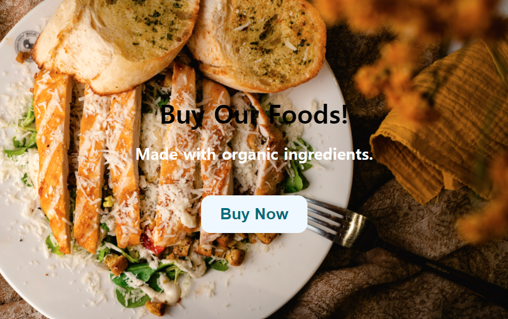

---

## position 속성과 좌표 레이아웃

display: block 속성을 가지고 있는 블럭들을 가운데 정렬하려면 원래는 아래와 같은 속성값들을 부여했어야 했다.

```css
.main-button {
  display: block;
  margin-left: auto;
  margin-right: auto;
}
```

하지만, position 속성을 이용해 좌표속성을 적용할 기준점을 정해 가운데 정렬하는 방법도 존재한다.

<position 속성값 종류>

```css
.example {
  position: static;
  position: relative;
  position: absolute;
  position: fixed;
}
```

1. static: 기준이 없음(좌표이동 원하지 않는 경우 지정)
2. relative: 자신의 원래 위치를 기준으로 이동
3. absolute: 자신의 부모를 기준으로 이동
4. fixed: 브러우저 창(현재 화면)을 기준으로 요소 고정

ex) 화면 스크롤할때 고정되어있길 바라면 fixed 사용

position 속성으로 기준점을 정해주고 top, left, bottom, right 속성을 사용해 좌표를 이동시켜주면 된다.

<br>

※ 주의할점 ※

position 속성을 부여하면 마치 이전에 배운 float 처럼 요소가 공중에 뜬다!

<참고>

position: absolute;를 적용해 요소를 가운데 정렬하기

```css
.example1 {
  position: absolute;
  left: 0;
  right: 0;
  margin-left: auto;
  margin-right: auto;
}
```

배운 position 속성을 이용해 main-background 위에 떠있는 sub-background를 생성해 보았다.

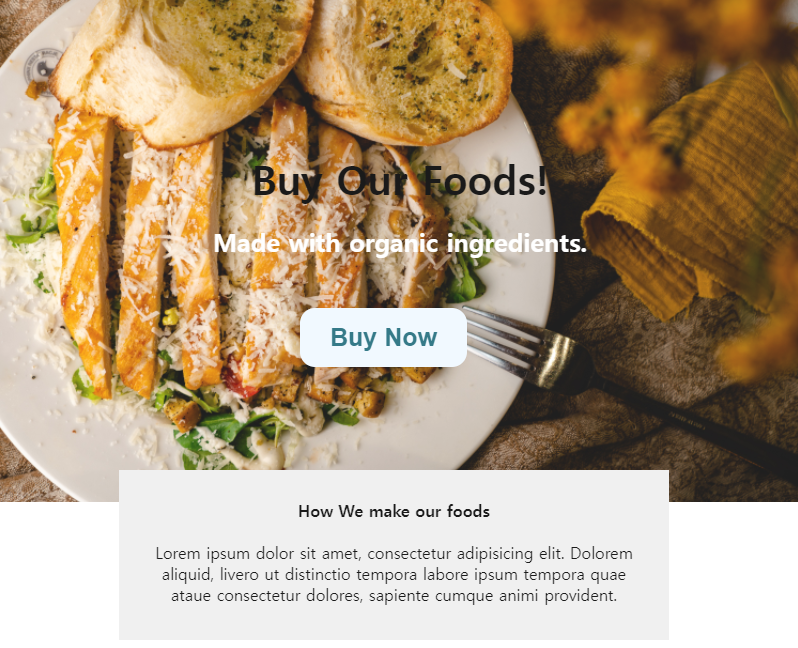

(나는 속성 여러개 써서 가운데 정렬했는데 알고보니 margin: auto 쓰니까 알아서 정렬해준다?!)

---

## width와 box-sizing

### 1) z-index

z-index 값이 높을수록 앞쪽에 존재한다.

### 2) max-width

width 속성에 % 값을 주면 부모를 기준으로 해당 %의 크기를 가지게 된다.

ex) width: 80% => 부모 width의 80% 크기

반응형 웹페이지를 제작할때 %를 많이 사용한다.

PC 사이즈에서 그냥 width에 %를 주게되면 만약 화면이 큰 모니터를 사용하는 경우 요소가 너무 커진다는 문제점이 있다. 따라서 <strong>max-width를 같이 사용해 그 이상으로 커지지 않게 제한</strong>을 두는 방법을 사용한다.

min-width, max-height... 등도 있다.

※ 주의할점 ※

width는 content 영역의 넓이를 의미하기 때문에 padding, border를 고려하지 않는다. 따라서 max-width를 600px로 설정해도 padding을 너무 많이 주게되면 실제 보여지는 박스의 폭은 주어진 padding만큼 더 늘어날 수 있어 다른 요소에 영향을 줄 수도 있다.

ex) box의 width: 600px인데, padding: 50px주면 실제 보이는 width는 700px이 된다.

<해결책>

content 부분만 width로 설정하지 말고 padding과 border도 포함하면 된다. <strong>box-sizing: border-box; 속성을 주면 padding과 border도 포함</strong>된다.

```css
.exampleBox {
  box-sizing: border-box; /*박스의 폭은 border까지 포함*/
  box-sizing: content-box; /*박스의 폭은 padding 안쪽*/
}
```

즉, 개발 시작 전에 div를 가진 모든 요소의 속성에 box-sizing: border-box를 주고 시작하면 편하다.
아래 코드는 CSS 파일 작성시 기본으로 쓰면 좋을 속성들이다.

```css
html {
  line-height: 1.15; /*기본 행간 높이*/
}

body {
  margin: 0px;
}

div {
  box-sizing: border-box;
}

/* 모든 h, p 태그 margin 균일하게 설정
li, a 태그에 text-decoration: none;
table 태그에 border-collapse: collapse; 등 */
```

브라우저마다 디자인이 다르게 보일수 있으므로 호환성 문제를 해결하기 위해 CSS 파일의 맨 위에 호환성 이슈 해결책부터 첨부하는 경우가 많다. 혹은 html에 link 태그로 추가.

이 CSS 파일을 다운받아서 개발 시작 전에 link 태그에 첨부해서 사용하면 좋다!

=> https://github.com/necolas/normalize.css/blob/master/normalize.css

---

## form과 input

form은 form 태그로 생성한다.

```html
<form action="경로" method="GET/POST">
  <input />
</form>
```

### 자주 사용하는 input의 type

```html
<input type="text" />
<input type="email" />
<input type="password" />
<input type="radio" />
<input type="file" />
<input type="checkbox" />
<!-- 전송 버튼 만드는법 -->
<input type="submit" />
<button type="submit">전송</button>

<select>
  <option>옵션1</option>
</select>

<textarea></textarea>
```

### input에 넣는 속성들

```html
<form>
  <input type="" value="" placeholder="" name="" />
</form>
```

1. type: input의 유형
2. value: 미리 입력된 값
3. placeholder: 배경 글자
4. name: 서버 기능 개발에 필요한 input의 이름 설정

name은 input의 내용을 서버로 전달할때 중요한 역할을 한다.

### input 셀렉터

input 스타일 디자인할때 input도 셀렉터를 사용할수 있다.

input[속성명=속성값]

ex) input[type=email] {}

<Contact us 창 만들기 완성본>

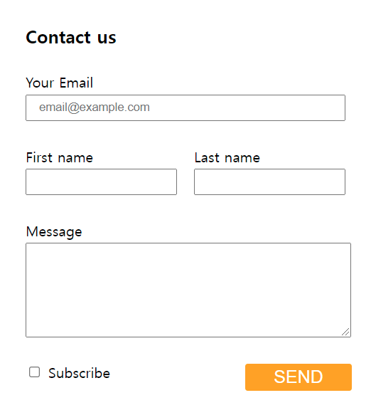

같은 크기로 정렬할때 아래 코드처럼 <u>하나의 큰 덩어리로 비슷한 종류의 블럭끼리 묶어주고 그것을 하나의 부모로 해서 %는 부모에 따라서 맞춰지는 거니까 width: 100%;와 같은 속성으로 맞춰</u>주면 편리하게 같은 크기로 딱딱 맞춰줄수 있는 느낌을 받음. 그 전까지는 width: n px로 직접 값을 늘리고 줄이며 맞춰줬었는데...

```html
<!-- 하나의 큰 부모 -->
<form class="form-container">
  <!--크기를 일정하게 맞춰줄 블럭 1-->
  <div class="email-box">
    Your Email<input
      class="email-form"
      type="email"
      placeholder="email@example.com"
    />
  </div>
  <!--크기를 일정하게 맞춰줄 블럭 2-->
  <div class="message-box">
    Message<textarea class="message-form"></textarea>
  </div>
</form>
```

```css
.form-container {
  width: 100%;
}
.email-form {
  width: 100%;
  display: block;
  height: 30px;
  margin-top: 5px;
}
.message-form {
  display: block;
  width: 100%;
  height: 100px;
  margin-top: 5px;
}
```

css에서 콤마(,)를 사용하면 셀렉터를 여러개 지정해줄 수 있다.

```css
div,
input,
textarea,
.className {
  box-sizing: border-box;
}
```

※ max-width, min-width 등을 사용해 반응형으로 만드는 습관을 기르자.

※ CSS 초보 특징: 새로운 박스를 만들때마다 새로운 class 명을 작성함(ㅋㅋㅋ완전 나였다 정곡찔려서 뜨끔...)

고수들은 만들어둔 클래스를 재사용할줄 알음! 따라서 class 만들때 어떻게 만들어야 재사용이 가능할지 고민하면서 하면 좋다.

그래서 나도 기존 코드를 중복을 제거해 리팩토링 해보았다.

```
<기존 코드에서 수정한 문제점들>

1. css에서 직접 패딩을 주었는데, 그냥 <p> 태그를 이용해 Your Email, First Name과 같은 글자에 자체 패딩을 줌

2. 입력폼의 css 속성이 모두 동일한데 서로 다른 class 이름을 사용해 효율적이지 않았던 코드의 중복되는 속성을 모두 묶어 재사용함(input-form이라는 클래스로 통일함) ★

3. max-width등을 사용해 반응형으로 바꿔봄

4. <label></label> 태그를 이용해 체크박스 옆의 글자(라벨)를 눌러도 체크박스가 활성화되게 바꿔줌
```

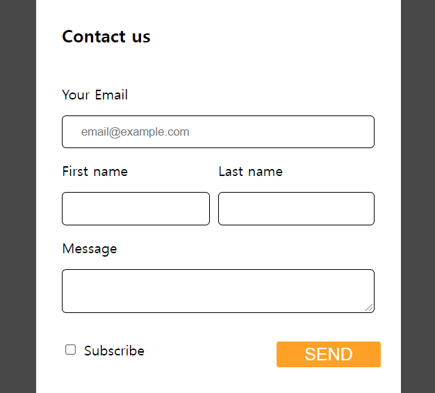

결과적으로 많이 바뀐것은 없지만 전보다는 조금 더 깔끔하고 이쁜 디자인을 갖게 된것 같고 쓸데없는 중복 css 코드들이 지워져서 코드가 보기 편해진 느낌을 받았다.

---

## Table 레이아웃 & vertical-align

장바구니같은거 만들때 자주 사용하는 표 레이아웃에 대해 공부

`<table></table>` 태그를 이용해 표를 만들수 있다.

```html
<body>
  <div>
    <table>
      <tr>
        <th>1</th>
        <td>2</td>
        <td>3</td>
      </tr>
    </table>
  </div>
</body>
```

1. `<th></th>` 태그를 사용하면 제목처럼 굵게 처리된다.
2. `<thead></thead>`, `<tbody></tbody>`와 같은 태그를 사용하기도 하는데 이는 헤드부분 영역을 구분하기 위해 사용되며

- 제목 행 => `<thead></thead>`안에
- 일반 행 => `<tbody></tbody>`안에

  넣으면 좋다.

table 태그를 생성하면 기본적으로 셀 간에 간격이 생기게 되는데 `border-collapse: collapse` 속성을 이용해 셀 간의 간격을 없앨수 있다.

또한 div 태그를 가지고도 표를 만들수 있다. (보통 사용할일은 드뭄)

```html
<div style="display: table">
  <div style="display: table-row">
    <div style="display: table-cell">1</div>
    <div style="display: table-cell">2</div>
  </div>
</div>
```

### vertical-align 속성

vertical-align: top/middle/bottom/super/sub;

1. inline/inline-block 요소 간의 세로정렬할 때 사용한다.

display: inline; -> 항상 옆으로 채워지는 폭과 너비가 없는 요소이다. ex) span 태그

이러한 태그를 가지고 있는 요소들을 나란히 배치했을 때 서로 높이가 맞지 않는 경우 margin-top과 같은 속성 대신 사용할 수 있다.

2. table 안에서 상하정렬할 때 사용한다. (top/middle/bottom)

```css
td,
th {
  vertical-align: middle;
}
```

<장바구니 페이지 만들어보기>

=> tableLayout.html / tableLayout.css

1. nth-child(n) 셀렉터는 n번째 등장하는 요소만 스타일링할 때 사용한다.

```css
/* td의 3번째 애들을 선택하라 */
td:nth-child(3) {
  text-align: center;
}

/* .cart-table 안의 모든 th의 3번째 나오는 애들을 선택해라! */
.cart-table th:nth-child(3) {
}
```

2. colspan="" / rowspan="" 속성을 이용해 셀 병합을 할 수 있다.

```html
<tr>
  <td colspan="5"><p class="total-price">€ 2968.00</p></td>
</tr>
```

3. 아래와 같이 콤마(,)로 여러개의 셀렉터를 지정할수 있으며 border-bottom과 같은 속성으로 원하는 테두리에만 스타일을 할 수도 있다.

```css
/* cart-table 안에 있는 모든 td 태그 */
.cart-table td,
.cart-table th {
  padding: 15px;
  /* 셀 병합이 아니라 이걸로 세로줄 없앨수 있음 */
  border-bottom: 1px solid #bcd0dd;
}
```

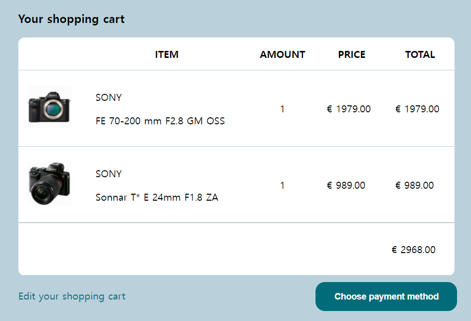

---

## 인터랙티브 버튼 만들기

pseudo-class를 이용해 인터랙티브 버튼을 만들수 있다.

button, input, a 태그 등에 자주 사용한다.

```css
.btn {
  /* 기본적인 버튼 생성 */
  padding: 15px;
  font-size: 20px;
  border: none;
  border-radius: 10px;
  background-color: coral;
  color: white;
  cursor: pointer;
}

.btn:hover {
  background-color: chocolate;
}

.btn:focus {
  background-color: grey;
}

.brn:active {
  background-color: brown;
}

input:focus {
  border: 2px solid red;
}

/* 방문 전 링크 상태 */
a:link {
  color: red;
}

/* 방문 후 링크 상태 */
a:visited {
  color: black;
}
```

- cursor: pointer/cell ... => 마우스 오버시 커서 모양 변경

<pseudo-class 종류>

- :hover => 마우스 올렸을 때 스타일 변경
- :active => 마우스를 누르고 있는 동안
- :focus => 클릭하고 나서 커서가 찍혀있을 때

※ hover, focus를, active 동시에 적용할때는 순서에 주의해야 한다.

hover -> focus -> active 순으로 정의해줘야 정상 작동한다!

---

## OOCSS, BEM

근데 현재처럼 React나 Vue를 사용하는 경우 예전만큼 중요하거나 유용한건 아니다.

**OOCSS(Objected Oriented CSS)**: 코드 양을 줄일수 있는 class 작명법이다.

쉽게 말해, 뼈대와 살을 분리하는 방법이라고 할수 있는데 이렇게 코드를 작성하면

1. 중복된 스타일을 재사용할수 있다.

2. 유지보수가 편리해진다.

3. 코드를 빠르게 작성할수 있다.

라는 이점을 얻을수 있다.

예로 아래와 같은 html에 button이 있다고 하자.

```html
<button class="main-btn bg-red">빨간 버튼</button>
<button class="main-btn bg-blue">파란 버튼</button>
```

```css
/* 버튼 만들때마다 재사용할 뼈대 */
.main-btn {
  padding: 15px;
  font-size: 20px;
  border: none;
  cursor: pointer;
}

/* 각 버튼마다 새롭게 적용할 살점 */
.bg-red {
  background: red;
}

.bg-blue {
  backgroudn: blue;
}
```

**BEM(Block Element Modifier)**: class를 작명하는게 어려울때 사용하면 편한 작명법이다.

1. 덩어리(컴포넌트) 이름으로 시작하는것이 좋다.

2. 태그마다 다른 class명을 부여할때 태그명을 뒤에 붙인다.

```html
<div class="profile">
  
  <h4 class="profile-h4"></h4>
  <p class="profile-content"></p>
  <button class="profile-button"></button>
</div>
```

3. 같은 태그들의 디자인을 구분하려면 --수식어(속성)를 붙인다.

빨강, 파랑 버튼과 큰, 작은 버튼이 각각 필요하다면

--red

--blue

--big

--small

이런식으로 --을 이용한 수식어를 붙여주면 쉽다.

※ 하지만 이런 방법은 html, css 파일이 방대한 경우 유용한 방법이고, 후에 공부할 React나 Vue를 사용하는 경우에는 html 페이지 단위가 아닌 작은 컴포넌트 단위로 개발해 class들이 중복되어도 컴포넌트끼리 스타일이 간섭되지 않기 때문에 그닥 유용하지 않다.

---

## 웹 폰트 넣는 법

<기본>

```css
body {
  margin: 0px;
  font-family: "nanumsquare", "arial", "...";
}
```

콤마(,)로 폰트명을 여러개 쓰면 가장 왼쪽에 있는 폰트부터 실패시 그 다음 폰트로 넘어가면서 적용된다.

혹은 폰트 파일을 호스팅 해주는 Google Fonts를 사용하자.

<커스텀>

```css
@font-face {
  font-family: "폰트 이름";
  src: url(폰트 경로);
}

@font-face {
  font-family: "폰트 이름";
  /* 폰트 굵기도 커스텀 설정해줘야 이쁨 */
  font-weight: 800;
  src: url(폰트 경로);
}

body {
  margin: 0px;
  font-family: "폰트 이름";
}
```

@font-face: 준비한 폰트 파일을 CSS에서 사용 가능하게 등록하는 과정

웹 폰트용으로 나온 파일인 .woff 파일 쓰자. ttf에 비해 용량을 3분의 1로 줄여준다.

굴림체와 같은 폰트는 기본적으로 조금 거칠게 출력되는데 이를 부드럽게 처리하려면 폰트를 매우 조금 회전시켜보면 된다.

```css
폰트가 적용된 태그들 {
  transform: rotate(0.03deg);
}
```

---

## 레이아웃 만들기(3) - Flexbox

이전까지는 블럭들을 가로로 배치하기 위해 float: left나 display: inline-block과 같은 방법을 사용했다. 하지만, 이런 방법은 추가해야할 속성들이 많으므로 display: flex;라는 속성을 이용해 요소들의 배치를 쉽게 할 수 있다.

flex의 특징은 마치 inline 요소 + table

즉, flex가 적용된 요소에 width: 600px으로 줘도 최대한 600px을 차지하려고 하지만, 정확하게 600px을 차지하지 않음.

<flex 이용시 정렬>

- justify-content
- flex-direction: column/row(반응형 웹)
- flex-wrap(width가 커지면 밑으로 보내고 싶을때)
- align-items(상하정렬)

- flex-grow(특정 박스만 키우기)

```html
<body>
  <div class="flexbox">
    <div class="flexbox-item logo">Logo</div>
    <!-- 박스 사이를 띄우려면 -->
    <div style="flex-grow: 1"></div>
    <div class="flexbox-item products">Products</div>
    <div class="flexbox-item services">Services</div>
  </div>
</body>
```

- align-content(박스가 가로로 여러줄일 때 상하배치 조절)
  : flex-start, flex-end, center, stretch, space-between, space-around;

---

## head 태그 안에 들어갈 내용

1. 각종 CSS 파일들

```html
<head>
  <link href="/css/main.css" rel="stylesheet" />
</head>
```

2. 스타일 태그

```html
<head>
  <style>
    .button {
      color: red;
    }
  </style>
</head>
```

html 파일은 위에 있는 코드 먼저 읽기 때문에 style은 위에 적는게 나음

3. 사이트 제목

```html
<head>
  <title>사이트 제목</title>
</head>
```

4. 여러 meta 태그

```html
<head>
  <meta charset="UTF-8" />
</head>
```

- charset: 사이트 인코딩 형식 지정
- name, content: 사이트 검색 결과 화면에 뜨는 글귀 수정
- name="viewport": 사이트 초기 zoom 레벨이나 폭을 지정

ex) width=device-width -> 모바일 기기의 실제 폭으로 렌더링해라. 반응형 웹 만들 때 사용

5. open graph

```html
<head>
  <meta property="og:image" content="/이미지경로.jpg" />
  <meta property="og:description" content="설명" />
  <meta property="og:title" content="제목" />
</head>
```

6. Favicon

```html
<head>
  <link rel="icon" href="아이콘경로.ico" type="image/x-icon" />
</head>
```

웹사이트 제목 옆에 뜨는 작은 아이콘 꾸미기(32 x 32 사이즈)

rel 속성을 조정해서 바탕화면에 바로가기 추가한 경우 뜨는 아이콘 같은것도 꾸미기 가능

---

## px 이외의 단위

- px: 기본 단위
- vw: 현재 브라우저의 폭에 비례해 설정(반응형 디자인시 유용)
- vh: 현재 브라우저의 높이에 비례해 설정
- rem: 기본 폰트사이즈(16px)에 비례 ex. 10rem = 160px

예를들어 font-size만 키우는 경우 폰트 크기만 커지기 때문에 스타일이 깨져 보이므로 모든곳을 rem으로 크기지정하면 폰트 크기가 커져도 모든게 같이 커지기 때문에 깨져보이는 것을 막을 수 있다. (요즘엔 'ctrl+마우스휠' 하면 같이 커지는데 딱히 필요 없을듯...)

- em: 내 폰트 사이즈의 X배

---

## 반응형 레이아웃

반응형 사이트를 만들려면 아래 코드를 꼭 사용해야 한다.

```html
<meta name="viewport" content="width=device-width, initial-scale=1.0" />
```

그리고 css에 media query 문법을 사용한다.

```css
@media screen and (max-width: 1200px) {
  /* ex) 브라우저 폭이 1200px 이하면 원래 40px였던 폰트 사이즈를 화면 크기가 설정한 기준 아래로 가면 30px로 바꾼다 */
  .main-title {
    font-size: 30px;
  }
}
```

media query 문법은 여러개 사용 가능하고 화면 큰사이즈 -> 작은 사이즈 순으로 작성한다. (아래처럼)

breakpoint 기준 px 값은 다른 사람들도 자주 사용하는 값으로 설정하자.

ex) 1200px -> 992px -> 768px -> 576px ...

기본적으로 1200px 이하 = 태블릿 / 768px 이하 = 모바일

```css
@media screen and (max-width: 1200px) {
  .main-title {
    font-size: 30px;
  }
}

@media screen and (max-width: 768px) {
  .main-title {
    font-size: 20px;
  }
}
```

<반응형 레이아웃 직접 만들어보기>

조건 1) 4개의 메뉴가 있음
조건 2) 데스크탑 버전에서는 모든 메뉴를 한줄에 출력
조건 3) 태블릿 버전에서는 2줄로 출력
조건 4) 모바일 버전에서는 4줄로 출력

```html
<div class="services-container">
  <div class="services-item">
    <h4>Fast Shipping</h4>
    <p>lorem ipsum</p>
  </div>
  <div class="services-item">
    <h4>Good Service</h4>
    <p>lorem ipsum</p>
  </div>
  <div class="services-item">
    <h4>Free Coupons</h4>
    <p>lorem ipsum</p>
  </div>
  <div class="services-item">
    <h4>New Products</h4>
    <p>lorem ipsum</p>
  </div>
</div>
```

```css
.services-container {
  width: 80%;
  max-width: 1000px;
  margin: auto;
  display: flex;
  flex-wrap: wrap;
}

.services-item {
  flex-basis: 25%;
  text-align: center;
}

@media screen and (max-width: 1200px) {
  .services-item {
    flex-basis: 50%;
  }
}

@media screen and (max-width: 576px) {
  .services-item {
    flex-basis: 100%;
  }
}
```

- 네줄에 표현하고 싶으면(하나의 요소가 한줄을 다 차지하고 싶으면) 100%

- 두줄에 표현하고 싶으면 50%

- 한줄에 표현하고 싶으면 25%

화면 width를 100이라 하고 출력할 요소가 4개 있다고 하면
`25+25+25+25 / 50+50 / 100` 이렇게 생각하면 원하는대로 레이아웃을 표현하기 쉽다.

<flex-basis와 width의 차이>

width는 요소의 너비를 결정한다. flex-basis는 요소의 너비를 결정한다고 할 수는 없고 다른 flex 속성(flex-grow, flex-direction 같은거)을 결정할때 기본 크기를 설정하는 것이라고 할 수 있다.

즉, 내 생각으론 width는 200px로 두면 요소가 흩어져도 크기가 고정되어 있지만, flex-basis를 사용한 경우 콘텐츠 너비에 따라서 늘어나고 줄어든다고 할 수 있을 것 같다. width보다 조금 더 유연하달까?

---

## IE 호환성 잡기

조건부로 CSS 파일을 첨부한다.

```html
<!-- [if lt IE 10] -->
<link href="css/ie.css" type="text/css" rel="stylesheet" />
<!-- <![endif]> -->
```

---

## Font Awesome 아이콘 넣기

1. CDN으로 설치 => all.min.css파일 링크 복붙, head 태그 안에 첨부

```html
<link
  href="https://cdnjs.cloudflare.com/ajax/libs/font-awesome/5.8.2/css/all.min.css"
  rel="stylesheet"
/>
```

2. 직접 파일 다운해 첨부: css랑 webfonts 폴더만 남기고 css 폴더 안에 all, all.min 파일만 남기면 된다.

위의 방법중 하나 실행 후 원하는 아이콘의 html을 복사해 원하는 위치에 붙여넣으면 된다.

```html
<div class="services-item">
  <!-- 이런식으로 -->
  <i class="fas fa-shopping-cart fa-2x"></i>
  <h4>Fast Shipping</h4>
  <p>lorem ipsum</p>
</div>
```

---

## Transition 속성으로 애니메이션 구현하기

애니메이션을 만드는 기본 STEP

- transition을 사용해서 애니메이션을 만들수 있다.

```
1. 시작 스타일 생성
2. 최종 스타일 생성
3. 언제 최종 스타일로 변할시 트리거 생성
   (hover 같은거)

4. transition 속성으로 서서히 동작하게 조절하기
```

<transition 세부 속성>

```css
.box {
  transition-delay: 1s; /* 시작 전 딜레이 */
  transition-duration: 0.5s; /* 작동 속도 */
  transition-property: opacity; /* 어떤 속성에 transition 입힐건지 */
  transition-timing-function: ease-in; /* 동작 속도 그래프조정 */
}
```

transition 실습 파일

=> transition-practice.html/.css

<transition-before 이미지>

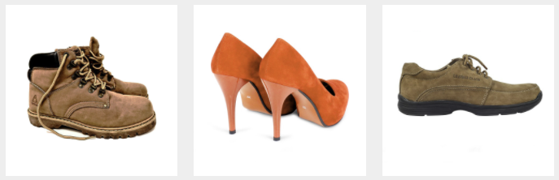

<br>

<transition-after 이미지>

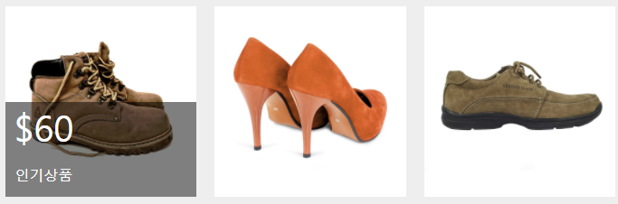

※ 추가 팁 ※

개발자 도구에서 점 3개 -> 도구 더보기 -> 애니메이션 누르고 애니메이션 실행시켜보면 어떤 속성이 바뀌면서 애니메이션이 작동하는지 세세히 볼 수 있음.

---

## LandingPage 실습

직접 만들어보면서 알게된 점 등을 적어보았다.

### flex 정리가 잘 되어있는 블로그 출처

https://studiomeal.com/archives/197

특히 flex를 이용해 n단 컬럼을 구현하는 부분 숙지해두기.

내가 잘 못하는 부분인듯

### 그라데이션 넣기

background: linear-gradient(to top, #594eb9 0%, #4997dc);

기본적으로 `linear-gradient(방향, 색1 색상점 위치, 색2 색상점 위치)`로 사용

linear 이외에 radial, repeating 등등이 더 있음.

### img 위에 글자 올리는 방법

- 이미지와 텍스트를 감싸고 있는 클래스(여기서는 .do-item)에 `position: relative;` 속성을 준다.

- 텍스트 클래스에 `position: absolute` 속성을 준다.

### img에 filter 속성 줬더니 이상해졌을때

- 이미지 위에 올려둔 텍스트가 이미지 아래로 간건지 갑자기 안보임.

- 텍스트에 z-index값을 올려주어 이미지보다 위로 오게 조정함

근데 filter 주고나서 왜 아래로 내려간거지?

### font Awesome은 폰트다

그러니까 text-align 같은거 써야된다.

### 여기저기 width: XX% 값 주다가 헷갈린다

여기저기 주다가 얘 부모가 누군지 왜 flex로 2줄 정렬(2X2) 하려는데 안되고 계속 한줄인지..

### 반응형으로 만들기(나한테는 제일 어려워)

@media query 쓰기 전에 코드부터 짜지 말고 어떤 스타일이 어떤 형식으로 달라져야 하는지 먼저 메모해두고 코드를 작성하면 조금 더 수월한듯

예를들어 여기서는

- 글자와 이미지는 가운데 정렬
- 글자와 아이폰 이미지가 세로로 배치
- 이미지는 크기 축소

이런식으로 미리 적어두고 쿼리를 짜면 편함!

### 버그

※ 뷰가 1800px이 넘어가면 아래 What we can DO의 flex 박스 형태가 무너짐 (1행에 3개 2행에 1개 이렇게 변함)
=> 일단 1900px 이하의 뷰만을 고려해서 반응형을 제작하였음

---

## Bootstrap 1

부트스트랩을 설치하려면 html에 아래 2개를 넣어야 한다.

1. bootstrap.min.css 넣기 -> head태그 안에

```html
<link
  href="https://cdn.jsdelivr.net/npm/bootstrap@5.1.3/dist/css/bootstrap.min.css"
  rel="stylesheet"
  integrity="sha384-1BmE4kWBq78iYhFldvKuhfTAU6auU8tT94WrHftjDbrCEXSU1oBoqyl2QvZ6jIW3"
  crossorigin="anonymous"
/>
```

2. bootstrap.bundle.min.js 넣기 -> body 태그 안에

```html
<script
  src="https://cdn.jsdelivr.net/npm/bootstrap@5.1.3/dist/js/bootstrap.bundle.min.js"
  integrity="sha384-ka7Sk0Gln4gmtz2MlQnikT1wXgYsOg+OMhuP+IlRH9sENBO0LRn5q+8nbTov4+1p"
  crossorigin="anonymous"
></script>
```

그리고 사용하고 싶은 것을 아래 링크에서 찾아 사용하면 된다.

https://getbootstrap.com/docs/5.1/getting-started/introduction/

### bootstrap 코드 복붙만으로 만든 간단한 레이아웃

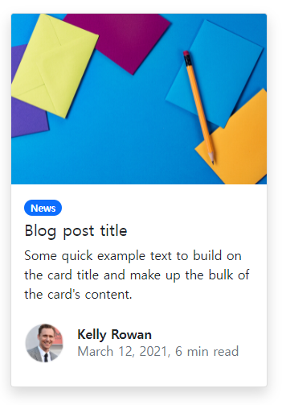

---

## Bootstrap 2 - grid

Bootstrap을 사용하더라도 결국 세세한 스타일은 직접 커스텀해야하기 마련이다. 그럼에도 Bootstrap을 쓰는 가장 큰 이유는 반응형 레이아웃을 만들때 매우 편리하기 때문이다.

특히 `박스를 균일하게 쪼개고 싶을 때 Bootstrap의 grid 레이아웃`을 사용하면 빠른 구현이 가능하다.

```html
<div class="row">
  <div class="col">안녕</div>
  <div class="col">안녕</div>
  <div class="col">안녕</div>
</div>
```

이런식으로 각각의 박스에는 `col`을 부모에게는 `row`클래스를 부여하면 된다.

이때 row는 내부를 12칸으로 쪼개주는 클래스명이고, `col-3`과 같은 클래스를 사용하면 이는 부모인 row의 12칸 중 3칸을 차지하겠다는 의미이다.

따라서 만약 12칸이 row를 2칸으로 쪼개고 싶으면 col-6을 사용하면 된다.

### col을 이용해 쪼갠것을 반응형으로 구현하기(1)

`col-md-6`, `col-lg-6`(==992px 이상에서만 col-6을 적용해주세요) 처럼 조건문을 사용하면 된다.

```
  xl -> 1200px
  lg -> 992px
  md -> 768px
  sm -> 576px
```

예를들어 PC에서는 4열, 태블릿에서는 2열, 모바일에서는 1열로 정렬되게 하려면 아래와 같이 작성하면 된다.

```html
<div class="row">
  <div class="col-lg-3 col-md-6">1</div>
  <div class="col-lg-3 col-md-6">2</div>
  <div class="col-lg-3 col-md-6">3</div>
  <div class="col-lg-3 col-md-6">4</div>
</div>
```

이러면 lg 사이즈인 992px 이상(PC)에서는 4열, md 사이즈인 768px이상 992px 미만(태블릿)에서는 2열로 정렬되게 된다. 그리고 768px 미만(모바일)으로 가게되면 1열로 정렬된다.

### col을 이용해 쪼갠것을 반응형으로 구현하기(2)

```html
<div class="row m-2">
  <div class="col-2 col-lg-2 order-lg-2">
    
  </div>
  <div class="col-10 col-lg-5 order-lg-1">
    <div>
      Lorem ipsum dolor sit amet. consectetur adipising elit. Possimus in nisi
      obcaecati.Natus ipsam.
    </div>
    <div class="col-lg-5 order-lg-3"></div>
  </div>
</div>
```

이런식으로 `order-조건문-n`을 이용해 순서도 변경할 수 있다.

---

## CSS 덮어쓰기

원본 소스 코드를 건들면 안되는 경우 새로운 CSS 파일로 덮어쓰기를 해야한다.

<덮어쓰기 하는 방법>

**1. 같은 클래스명을 원본보다 더 아래에 작성하기**

같은 class를 가지고 있으면 더 밑에 있는게 우선 적용되는 특징을 가지고 있기 때문

```html
<!-- 원본 css -->
<link href="main.css" />
<!-- 덮어쓸 css -->
<!-- 원본 보다 더 하단에 작성 -->
<link href="main2.css" />
```

**2. 우선순위를 높이기**

개인적으로 비추임

class < id < style < !important

**3. specificity 높이기**

근데 이렇게 셀렉터를 길게 적으면 후에 유지보수가 힘듬.

```css
/* 21점 */
div.main-background .custom {
  color: red;
}

/* 20점 */
.main-background .custom {
  color: green;
}
```

### 좋은 코드?

1) 후에 유지보수(수정/관리)가 쉬우면
2) 확장성이 좋으면